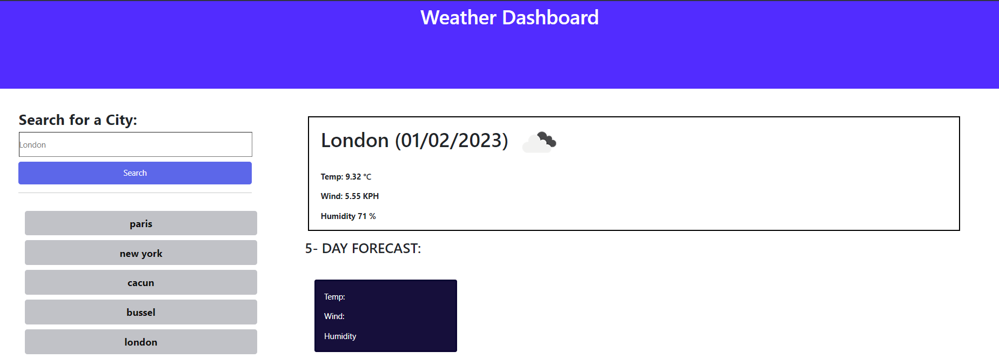

### DAY PLANNER

<!-- ABOUT THE PROJECT -->
## About The Project
This project is basically design to display the weather information of all the cities across the world, each city serach is save on local storage which enable the user to just click on it instead of rewrite in the input type provide. It's convient to monitor the weather condition and make plan in accordance of the result provide.

## Built With

* HTML
* CSS
* BOOTSTRAP
* JQUERY
* Moment

<!-- GETTING STARTED -->
## Getting Started

This is an example of how you may give instructions on setting up your project locally.
To get a local copy up and running follow these simple example steps.

../assets/images/weather_forcast.png

<!-- USAGE EXAMPLES -->
## Usage
Type in the city of you choose to in the input type na click on serach or enter button to view the waether condition of your choice of city. you can also, as you search through, the cities are listed below which are clickable to obtain the weather information.

<!-- screenshoot -->
#preview of the site

<!-- CONTRIBUTING -->
## Contributing

Contributions are what make the open source community such an amazing place to learn, inspire, and create as we lear everyday despite all. Any contributions on how the project will be more effective and better is highly welcome.

Kindly follow the steps below to implement the change for enhancement.

* Fork the Project
* Create your Feature Branch 
* Commit your Changes 
* Push to the Branch.
* Open a Pull Request

<!-- LICENSE -->
## License
Please refer to the LICENSE in the repo.

Distributed under the MIT License. See `LICENSE.txt` for more information.

<!-- CONTACT -->
## Contact
Email: okemba50@gmail.com

Project Link:https://preshy59.github.io/weather_dashboard/
